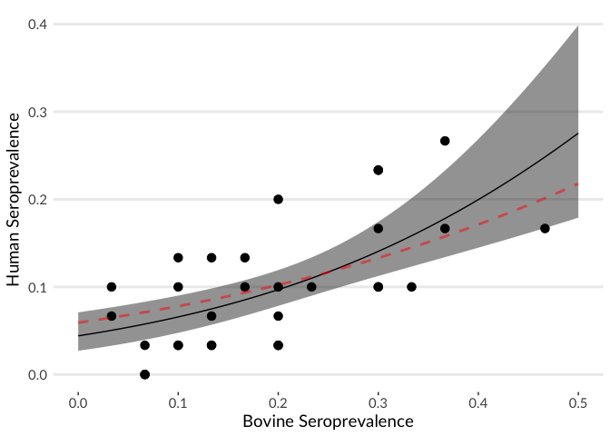
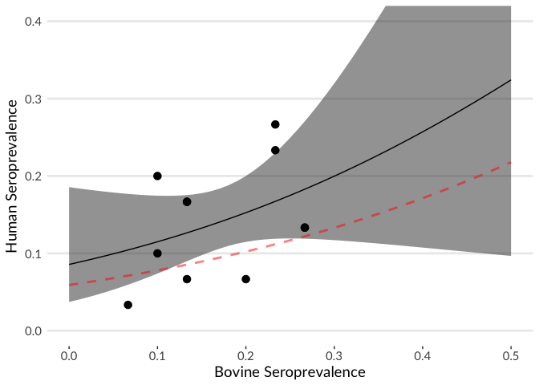
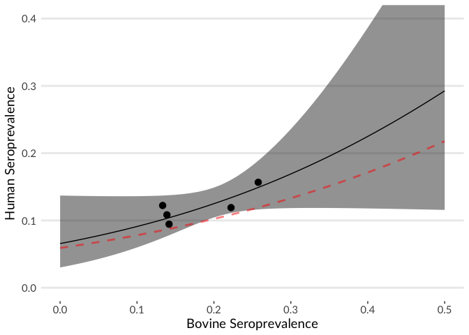

# Simulation of separate v. One Health spatial sampling of RVF in Madagascar
Noam Ross  
2016-09-12  


```r
P <- rprojroot::find_rstudio_root_file
library(docxtractr)
library(tibble)
library(dplyr)
```

```
## 
## Attaching package: 'dplyr'
```

```
## The following objects are masked from 'package:stats':
## 
##     filter, lag
```

```
## The following objects are masked from 'package:base':
## 
##     intersect, setdiff, setequal, union
```

```r
library(readr)
library(tidyr)
library(magrittr)
```

```
## 
## Attaching package: 'magrittr'
```

```
## The following object is masked from 'package:tidyr':
## 
##     extract
```

```r
library(ggplot2)
library(noamtools)
library(mclust)
```

```
##     __  ___________    __  _____________
##    /  |/  / ____/ /   / / / / ___/_  __/
##   / /|_/ / /   / /   / / / /\__ \ / /   
##  / /  / / /___/ /___/ /_/ /___/ // /    
## /_/  /_/\____/_____/\____//____//_/    version 5.2
```

```
## Type 'citation("mclust")' for citing this R package in publications.
```

```r
library(purrr)
```

```
## 
## Attaching package: 'purrr'
```

```
## The following object is masked from 'package:mclust':
## 
##     map
```

```
## The following object is masked from 'package:magrittr':
## 
##     set_names
```

```
## The following objects are masked from 'package:dplyr':
## 
##     contains, order_by
```

```r
library(lme4)
```

```
## Loading required package: Matrix
```

```
## 
## Attaching package: 'Matrix'
```

```
## The following object is masked from 'package:tidyr':
## 
##     expand
```

```r
library(scales)
```

```
## 
## Attaching package: 'scales'
```

```
## The following object is masked from 'package:purrr':
## 
##     discard
```

```
## The following objects are masked from 'package:readr':
## 
##     col_factor, col_numeric
```

```r
# Data come from Olive et al (2016, https://dx.doi.org/10.1371/journal.pntd.0004827)
# Extract data from supplemental info word doc
olive_tbls = docx_extract_all_tbls(read_docx("data/journal.pntd.0004976.s001.DOCX"))

olive_data = as_tibble(bind_rows(olive_tbls[-(length(olive_tbls))])) %>%
  mutate(IgG = as.numeric(IgG),
         PCODE = as.factor(PCODE)) %>%
  mutate_each("as.numeric", age, fact1, fact2, fact3, fact4)
olive_metadata = as_tibble(olive_tbls[[length(olive_tbls)]])


# Define logit functions
fwdlogit = binomial()$linkfun
invlogit = binomial()$linkinv


# Define regions using the environmental factor data
regions = distinct(olive_data, PCODE, fact1, fact2, fact3, fact4)
cl_mod = Mclust(select(regions, -PCODE), G=1:20)
regions = regions %>%
  mutate(region = as.factor(predict(cl_mod)$classification))

dat = left_join(olive_data, regions, by = c("PCODE", "fact1", "fact2", "fact3", "fact4")) %>%
  filter(sp=="bovine") %>%
  droplevels()

# Estimate seroprevalence for cattle for all the sites in the real data
mod = glmer(IgG ~ 1|region/PCODE, data = dat, family = binomial)

# Simulate a system where site-level human seroprevalence is about half of cattle
sim_sites = dat %>%
  distinct(region, PCODE)
sim_sites = sim_sites %>%
  mutate(bov_sero = predict(mod, newdata=sim_sites, type="response")) %>%
  mutate(hum_sero = invlogit(-2.767566 + 2.977532*bov_sero + rnorm(length(bov_sero), sd=0.1))) %>%
  mutate(region = as.character(region), PCODE=as.character(PCODE))

# Simulate sampling both humans and cattle at 30 random sites
set.seed(0)
sim_indiv1 = sim_sites %>%
  sample_n(30) %>%
  pmap_df(function(region, PCODE, bov_sero, hum_sero) {
                       tibble(region=region,
                                  PCODE=PCODE,
                                  bov_IgG = as.numeric(runif(30) < bov_sero),
                                  hum_IgG = as.numeric(runif(30) < hum_sero))
                       }) %>%
  group_by(region, PCODE) %>%
  mutate(bov_sero = sum(bov_IgG)/n()) %>%
  group_by()

#Simulate sampling at 30 random sites for humans, 30 for cattle, and combine
sim_indiv2a = sim_sites %>%
  sample_n(30) %>%
  pmap_df(function(region, PCODE, bov_sero, hum_sero) {
  tibble(region=region,
         PCODE=PCODE,
         sp="bov_IgG",
         IgG = as.numeric(runif(30) < bov_sero))
})

sim_indiv2b = sim_sites %>%
  sample_n(30) %>%
  pmap_df(function(region, PCODE, bov_sero, hum_sero) {
    tibble(region=region,
           PCODE=PCODE,
           sp="hum_IgG",
           IgG = as.numeric(runif(30) < hum_sero))
  })

sim_indiv2 = bind_rows(sim_indiv2a, sim_indiv2b) %>%
  group_by(region, PCODE) %>%
  do({
    bov_IgG = .$IgG[.$sp=="bov_IgG"]
    hum_IgG = .$IgG[.$sp=="hum_IgG"]
    if(length(bov_IgG) == 0 ) bov_IgG = NA
    if(length(hum_IgG) == 0 ) hum_IgG = NA
    tibble(region=.$region[1],
         PCODE=.$PCODE[1],
         bov_IgG=bov_IgG,
         hum_IgG=hum_IgG
         )
  }) %>%
  group_by()


# For the separate simulation, create a data subset that just includes sites that
# happen to have both people and cattles sampled
sim_indiv2_site = sim_indiv2 %>%
  na.omit() %>%
  group_by(region, PCODE) %>%
  mutate(bov_sero = sum(bov_IgG)/n()) %>%
  group_by()

# For the separate simulation, pool sites by region to so as to compare
# more sites, but at the regional level so as to compare human and cattle data
sim_indiv2_region = sim_indiv2 %>%
  group_by(region) %>%
  mutate(bov_sero = sum(bov_IgG, na.rm=TRUE)/sum(!is.na(bov_IgG))) %>%
  group_by() %>%
  filter(!is.na(hum_IgG))

# Fit models of human seroprevalence as a function of cattle seroprevalence
# When sites are paired
sim_mod1 = glm(hum_IgG ~ bov_sero, data= sim_indiv1, family = binomial)
# For paired sites when sampling is separate for cattle and humans
sim_mod2_site = glm(hum_IgG ~ bov_sero , data= sim_indiv2_site, family = binomial)
# For pooled regions when sampling is separate for cattle and humans
sim_mod2_region = glm(hum_IgG ~ bov_sero, data= sim_indiv2_region, family = binomial)

# Summarize the models results:
summary(sim_mod1)
```

```
## 
## Call:
## glm(formula = hum_IgG ~ bov_sero, family = binomial, data = sim_indiv1)
## 
## Deviance Residuals: 
##     Min       1Q   Median       3Q      Max  
## -0.7557  -0.4825  -0.3946  -0.3444   2.4444  
## 
## Coefficients:
##             Estimate Std. Error z value Pr(>|z|)    
## (Intercept)  -3.0764     0.2519 -12.212  < 2e-16 ***
## bov_sero      4.2194     0.9616   4.388 1.14e-05 ***
## ---
## Signif. codes:  0 '***' 0.001 '**' 0.01 '*' 0.05 '.' 0.1 ' ' 1
## 
## (Dispersion parameter for binomial family taken to be 1)
## 
##     Null deviance: 593.89  on 899  degrees of freedom
## Residual deviance: 574.74  on 898  degrees of freedom
## AIC: 578.74
## 
## Number of Fisher Scoring iterations: 5
```

```r
summary(sim_mod2_site)
```

```
## 
## Call:
## glm(formula = hum_IgG ~ bov_sero, family = binomial, data = sim_indiv2_site)
## 
## Deviance Residuals: 
##     Min       1Q   Median       3Q      Max  
## -0.6357  -0.6049  -0.5201  -0.4942   2.1261  
## 
## Coefficients:
##             Estimate Std. Error z value Pr(>|z|)    
## (Intercept)  -2.3677     0.4444  -5.328 9.92e-08 ***
## bov_sero      3.2667     2.2978   1.422    0.155    
## ---
## Signif. codes:  0 '***' 0.001 '**' 0.01 '*' 0.05 '.' 0.1 ' ' 1
## 
## (Dispersion parameter for binomial family taken to be 1)
## 
##     Null deviance: 270.16  on 329  degrees of freedom
## Residual deviance: 268.13  on 328  degrees of freedom
## AIC: 272.13
## 
## Number of Fisher Scoring iterations: 4
```

```r
summary(sim_mod2_region)
```

```
## 
## Call:
## glm(formula = hum_IgG ~ bov_sero, family = binomial, data = sim_indiv2_region)
## 
## Deviance Residuals: 
##     Min       1Q   Median       3Q      Max  
## -0.5680  -0.5680  -0.4687  -0.4665   2.1400  
## 
## Coefficients:
##             Estimate Std. Error z value Pr(>|z|)    
## (Intercept)  -2.6559     0.4077  -6.514 7.32e-11 ***
## bov_sero      3.5459     1.9237   1.843   0.0653 .  
## ---
## Signif. codes:  0 '***' 0.001 '**' 0.01 '*' 0.05 '.' 0.1 ' ' 1
## 
## (Dispersion parameter for binomial family taken to be 1)
## 
##     Null deviance: 680.13  on 899  degrees of freedom
## Residual deviance: 676.68  on 898  degrees of freedom
## AIC: 680.68
## 
## Number of Fisher Scoring iterations: 4
```

```r
# Calculate what the "true" mean should be.
true_line = data_frame(
  bov_sero = 0:50/100,
  hum_sero = invlogit(-2.767566 + 2.977532*bov_sero)
)

# Plot the model results, data and confidence intervals against the true relationship


# For paired sites
sim_indiv1_sum = sim_indiv1 %>%
  group_by(region, PCODE) %>%
  summarise(bov_sero = bov_sero[1], hum_sero = sum(hum_IgG)/n())
sim_indiv1_line = data_frame(bov_sero = 0:50/100)
p1 = predict(sim_mod1, newdata=sim_indiv1_line , type="link", se.fit=TRUE)
sim_indiv1_line = mutate(sim_indiv1_line,
  hum_sero = invlogit(p1$fit),
  low = invlogit(p1$fit - 2*p1$se.fit),
  high = invlogit(p1$fit + 2*p1$se.fit))

ggplot(sim_indiv1_sum, aes(x=bov_sero, y=hum_sero)) +
  geom_ribbon(data = sim_indiv1_line, mapping=aes(ymin=low, ymax=high), alpha=0.5) +
  geom_point(size=3) +
  geom_line(data = sim_indiv1_line) +
  geom_line(data = true_line, col="red", lty=2, lwd=1, alpha=0.5) +
  xlab("Bovine Seroprevalence") + ylab("Human Seroprevalence") +
  scale_y_continuous(limits=c(0, 0.4), oob=rescale_none) + xlim(0, 0.5) +
  theme_nr
```

<!-- -->

```r
# For paired sites when sampling is separate for cattle and humans
sim_indiv2_site_sum = sim_indiv2_site %>%
  group_by(region, PCODE) %>%
  summarise(bov_sero = bov_sero[1], hum_sero = sum(hum_IgG)/length(hum_IgG))
sim_indiv2_line = data_frame(bov_sero = 0:50/100)
p2_site = predict(sim_mod2_site, newdata=sim_indiv1_line , type="link", se.fit=TRUE)
sim_indiv2_line = mutate(sim_indiv2_line,
                         hum_sero = invlogit(p2_site$fit),
                         low = invlogit(p2_site$fit - 2*p2_site$se.fit),
                         high = invlogit(p2_site$fit + 2*p2_site$se.fit))
ggplot(sim_indiv2_site_sum, aes(x=bov_sero, y=hum_sero)) +
  geom_ribbon(data = sim_indiv2_line, mapping=aes(ymin=low, ymax=high), alpha=0.5) +
  geom_point(size=3) +
  geom_line(data = sim_indiv2_line) +
  geom_line(data = true_line, col="red", lty=2, lwd=1, alpha=0.5) +
  xlab("Bovine Seroprevalence") + ylab("Human Seroprevalence") +
  scale_y_continuous(limits=c(0, 0.4), oob=rescale_none) + xlim(0, 0.5) +
  theme_nr
```

<!-- -->

```r
# For pooled regions when sampling is separate for cattle and humans
sim_indiv2_region_sum = sim_indiv2_region %>%
  group_by(region) %>%
  summarise(bov_sero = bov_sero[1], hum_sero = sum(hum_IgG)/length(hum_IgG))
sim_indiv2b_line = data_frame(bov_sero = 0:50/100)
p2_region = predict(sim_mod2_region, newdata=sim_indiv2b_line , type="link", se.fit=TRUE)
sim_indiv2b_line = mutate(sim_indiv2b_line,
                         hum_sero = invlogit(p2_region$fit),
                         low = invlogit(p2_region$fit - 2*p2_region$se.fit),
                         high = invlogit(p2_region$fit + 2*p2_region$se.fit))
ggplot(sim_indiv2_region_sum, aes(x=bov_sero, y=hum_sero)) +
  geom_ribbon(data = sim_indiv2b_line, mapping=aes(ymin=low, ymax=high), alpha=0.5) +
  geom_point(size=3) +
  geom_line(data = sim_indiv2b_line) +
  geom_line(data = true_line, col="red", lty=2, lwd=1, alpha=0.5) +
  xlab("Bovine Seroprevalence") + ylab("Human Seroprevalence") +
  scale_y_continuous(limits=c(0, 0.4), oob=rescale_none) + xlim(0, 0.5) +
  theme_nr
```

<!-- -->


---
title: "one_health_spatial_simulation.R"
author: "noamross"
date: "Mon Sep 12 18:47:24 2016"
---
